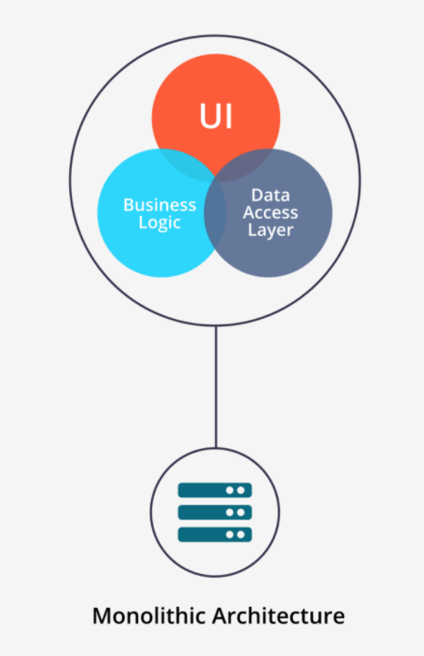
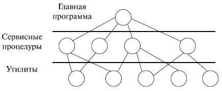

# Лекция 4
---
## Системная архитектура
>__Мы говорим о совокупности аппаратоного и программного обеспечения, а так же о пользователях__
---
__Идеального решения нет__
__Почему ?__
1. Противоречивость требований, предяъвляемых к операционной системе
   1. Нам все время нужно иметь компрамисс, поэтому мы ищем не идеальное а компромисное рещение
2. Проблема в том, что ОС является открытой(вот тут не понял)

### Основной вопрос. Что и как будет выполняться в ядре, а что будет выводено за пределы ядра ?

### А что такое ядро ?
* Более сложное и конкретное понятие чем обычное ядро при разработке приложений
* Эта та часть программного обеспечения, которая инварианта относительно использования операционной системы. То есть код ядра в приложении остается неизменным
### Ядро в операционной системе
Каждая операционная система должна абстрагировать ее компоненты друг от друга, то есть данные не должны иметь прямого доступа к аппаратному обеспечению, точно так же как и пользователь не должен иметь прямого доступа к аппаратному обеспечению. Роль абстрагирования компонентов друг от друга на себя берет операционная система. 
>Ядро операционной системы эта та часть кода операционной системы, которая отличается двумя харатеристиками, присущеми только ей. 
* Резидентность - то есть постоянное нахождение кода в одном и том же месте в оперативной памяти (__под этим понимается то, что код ядра не должен переноситься по оперативной памяти, он всегда стоит на своем месте__)
* Превилигированный режим 
> Характеристика именно ядра операционной системы, то есть ядро имеет привелегии. Код, выполняемый в привелигированном режими не ограничивается проверками на доступ к памяти. За счет этого мы обеспечиваем работу с любыми устройствами. 
Для обеспечения привеллигированого режима, существуют:
  >* Безусловные инструкции - выполняются всегда
  >* Условные инстркции - выполняются выборочно

### Почемы вопрос с ядром становится основой для различения и выделения архитектур операционных систем ?
* Нужно решить задачу резедентности
  * много кода под ядро -> много памяти нужно занять -> нам нужно выбирать те архитектуры ядер, которые не сожержат много кода, чтобы сэкономить память
* Надежность
  * Ошибки в коде ядра могут быть фатальны для пользователя и оси
  * Опять же, давайте делать ядра маленькими
* Безопасность
  * Если мы делаем ядра маленькими -> часть функций выполняется в непривелигерованном режиме -> нужно делать переключения между режимами -> сложно обеспечить безопасность выполнения кода
  * Поэтому, кажется, что в ядре нужно разместить как можно больше функций
* Производительность
  * Все компоненты могут вызвать друг друга
    * Если часть кода вынести из ядра, нужно будет делать постоянные переходы из обычного режима в привелигерованный -> опять теряем время на переключение.

## Принципы основы проекторивания и разработки операционных систем
* Принцип модульной организации
  * Операционная система это совокупность инкапсулированных модулей
* Принцип функциональной избыточности
  * Операционная система должна обладать большим функционалом чем нужно любому пользователю для длительной эксплуатации. Должна быть реализована поддержка модулей, которые будут реализованны в будущем.
* Принцип функциональной изберательности
  * Операционная сситема должна обладать выбором включения необходимых компонентов по мере их надобности. Например, у нас есть несколько версий операционной системы __Windows__
    * __Windows proffesional__
    * __Windows server__
    * __Windows home__
  * Каждая из этих системы включают в себя особый функционал, который не нужен другим системам
* Прицнип параметрической универсальности
  * Операционная система как можно больше своих параметров должна выносить во внешнюю среду
    * Файлы реестров
    * Конфиги
    * Мини СУБД
  * > Все что можно определить как управляемый параметр, нужно выносить вне
  * Например, мы отдали под ячейку адресов на запись на жесткий диск столько памяти, что максимально можно записать 1 терабайт. Прошло время и нам потребовалось записать уже 2 терабайта, но сделать этого мы не сможем, потому что мы в hardware определили ячейки так, что максимально можно записывать 1 терабайт, поэтому лучше было опередять эти ячейки как управляемый параметр. 
* Принцип многоуровневой иерархической операционной системы
  * Операционная система должна быть многоуровневой
* Принцип разделения модулей ядра на 2 группы
  * Модель ядра
  * Модуль, относящийся к вспомогательным функциям

## Разбираем непосредственно архитектуры операционных систем
---
## 1 - Монолитная архитектура

> Все модули находятся в рамках одного адресного пространства, компилируются как совокупность процедур, линкуясь в большой последовательно исполняемый код
__Монолитная архитектура соответсвует принципу модульной организации__
### Выделили несколько слоев монолитной архитектуры
* __Main programm__ - один модуль, взвимодействует с сервисами, может и с утилитами
* __Services__ - совокупность модулей, взаимодействует с утилитами
* __utilities__ - совокупность модулей, взаимодействует с аппаратным обеспечением

### Зачем нужно такое разделение ?
* Есть пользовательское по
* Есть аппаратное обеспечение
* Утилиты - это драйвера, они обеспечивают взаимодействие с реальным оборудованием, каждая утилита реализует протокол взаимодействия с контроллером
* Main programm - это интерфейс, который обеспечивает системный вызов
  * > Какое-то пользовательское программное обеспечение делает __SYSTEM CALL__ и __Main programm__ понимает, какие ресурсы нужно выделить и что сделать, чтобы обработать этот системный вызов
  * Как это происходит ?
    * Пользовательское __по__ вмещает в свое адрессное пространство в качестве параметров некий идентификатор системнового вызова (например получение файла) и инициирует программное прерывание. В этот момент управление переходит к ядру, ядро смотрит на системный вызов и понимает, что с ним нужно сделать. Теперь нужно его выполнить:
      * __Utilities__ могут работать только с железом, поэтому выделяется средний слой __services__
      * __Main programm__ дергает один или совокупность __services__
      * __Services__ дергают __utilities__ и обеспечивает выполнение задачи или выкидывает ошибку, докладывает главной программе, сообщив об успешном выполнении или выдовая ошибку
#### Преимущетсва монолитной архитектуры
* Быстродействие, все всех видят, каждый может каждого вызвать
* Все безопасно - все решения принимаются в ядре
#### Недостатки монолитной архитектуры
* Проблемы с надежность, потому что ядро должно быть резидентным, а компонентов очень много
* Проблемы с памятью опять же из-за того, что нужно обеспечивать резидентность ядру
* Проблема возникает, когда появляется много __services__, появлятеся необходимость разделить их

## 2 - многослойная архитектура (это не новая архитектура, это концепция)
Наша операционная система это набор концентрических слоев
* __Hard ware__
* __Средство аппаратной поддержки ядра__
  * Система прерываний
  * Средство связанной с пожжержкой привилегированного режима
  * Средство поддержки виртуальной памяти
  * Смена регистровых контекстов (сохранение состояний регистров)
  * Системный таймер 
  * Защита памяти
* __Машинно зависимые модули (HAL)__
> Независимость от порграммного обеспечения, система должна иметь возможность работать с разным железом.
> Та часть кода ядра, которая зависит от конкретной платформы.
* __Базовые механизмы ядра__ - можули которые могут работать с нужными структурами данных, они обеспечивают выполнение плана, сгенерированного менеджером ресурсов
* __Менеджеры ресурсов__ - составляе план выполненения комманд
* __53 минута__