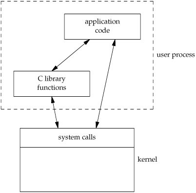

# Лекция 2

## Мультипрограммные операционные системы
### Задача: программы должны разделять время cpu
### В чем необходимость ?
* Наши приложения обладают различным поведением, соответственно, они с разной нагрузкой воздействуют на **CPU**
* Параллельность может стать псевдопараллельной, потому что может меняться поведение программы в процессе ее выполнения. Нам нужно избавиться от псевдопараллельности.
    > Было бы здорово иметь много программ в памяти и грамотно взаимодействовать с ними

### 1 Задача - обеспечение времени разделения процессора
> **Будем рассматривать только те процссоры, которые будут 1 ядерными >> все процессы должны будут считаться на 1 ядре**
#### Что нужно для разделения времени процессора?
  * Есть 2 процесса. Будем чередовать их выполнение.
  * Как сделать переход ?
  * Нужно запомнить место, где процесс остановился.
    * Сохранить значения регистров.
    * Загрузить данные в регистры для нового процесса **(это требует врмени)**
#### Как процессу остановить другой процесс?
* Решение на аппаратном уровне (как контроллер для spooling'a)
  * Добавили таймер, который через равные промежутки прерывает выполнение процессов.
  * Прерывание - это передача управления процессами диспетчеру прерывания

### 2 Задача - необходимо разделять память
* Когда мы компилируем **по**, мы работаем с адрессами в памяти так как используем низкоуровневый язык.
* В момент запуска программы, мы не можем знать, где операционная система выделит память под наше **по**.
* **Как узнать адреса, где будет храниться программа в момент разработки программы ?**
#### Решение: механизм - виртуальная память 
> Это абстаркция, которая позволяет нам в вирутальном адресном пространстве осуществлять перевод виртуальных адресов в физические (то есть это нужно для того, чтобы мы могли перенести адреса, которые мы создавали при проектировании в реальные адреса в памяти эвм)
### 3 Задача - обеспечние защиты программы от действия других программ
* Надо защищать адресное пространствох
  * В результате ошибки программиста, мы можем выйти за пределы адресного пространста, если мы что-то туда запишем, возникнет сбой
#### Механизм защиты памяти - аппаратное решение
* Он будет проверять права доступа для записи или чтения
* **Прервыание по защите памяти**
  * Простое рещение - уничтожить процесс, котторые пытается сделать что-то противозаконное
### 4 Задача -  планирование выполнения программы
#### Необходимость в планировании выполнения пакетов
* Мы могли выбирать один из очереди и отправлять на выполнение
* Ситуация поменялась - теперь надо разделять процессорное время:
  * Задача планирования становится многофакторной, в этой ситуации планировщики усложняются, но их нельзя сильно усложнять. Поэтому появляются решения, которые мы рассмотрим в следующих лекциях

### 5 Задча - задача по синхронизации
* Нужны механизмы, которые обеспечат межпроцессорную синхронизацию
### 6 Задача - задача доступа к иформации на внешнем хранилище
* При мультипрограммности поялвется проблема контрлируемого доступа к данным в хранилище
  * нужно обесепчить очередь
  * Нужно праивльно выбрать адреса в хранилище (__для ускорения линковки например__)
    * Можно хранить программы в библиотеке на хранилище и подгружать их
      * Нужна особая адрессация
  * __Появляется механизм файлово - катологовой системы__
    * Даем уникальные имена
    * Группируем их в дирректории
    * Выстраиваем иерархию между ними
    * Получаем контролируемый доступ к данным в хранилище

## Что мы иммеем? Появляется термин виртуальная машина
>__На этапе 60 годов это значит, что каждый процесс выполняется в рамках какой-то операционной системы__
* Эта концепция приводит к появлению независимости оси от программного обеспечения

* Появлется мехаизм [SYSTEM CALL](https://ru.wikipedia.org/wiki/Системный_вызов) - генерируется ситемный вызов, ось принимает решение по предоставлению ресурсов

* Между пользоватеелм и осью появляется пользовательский интерфейс (__API__)

## Первая операционная система - в 1963 появилась MCP (main controll programm)

# 3 Этап - сетевые операционные системы
* Проблемы
  * Много данных
  * Машины очень дорогие
  * Количестов потребителей растет => возникает разделение машинного времени среди пользователей
  * Накладные расходы
  * Ввод и вывод - узское место. Много программ, один оператор, который вводит программ в компьютер -> снижение эффективности использоавния компьютера
## Решение - Удаленные терминалы
* Объединим входные и выходные устройства
* Звоним в вычислительный узел и просим что-то вычислить
* Появляется многотерминальная проблема
  * Безопасность - нет оператора, который контролирует ввод и вывод, можно внести вирус
    * Появляется механизм аутентификации и авторизации
    * Вводится понятие пользователя и пользовательский режим
* Появляется удаленное взаимодействие между различными вычислительными узлами
  * есть 2 города с машинами, появляется механизм по обмену данными между машинами
  * __Появляются распределенные операционные системы__

# 4 Этап - открытые операционные системы
* Предпосылка
  * Проблема переносимости кода
  * Нужна ось, которая может запускаться на различных компьютерах
* Проблемы:
  * Нужна ось, которая сама по себе будет работать на языке выского уровня
    * Пояляется проблема курицы и яйца
* Bella boretlis - великая компания
  * Они создают Unix и C
  * В 1969 году выходит операционная система unix (UNICS), написанная на асемблере
  * На следующем этапе эта команда разрабытывает язык би и unix переписывается под нее
  * Выходит 3 редакция с компилятором си 
  * Выходит 4 редакция с ядром, написанным на си
  * Выходит 5 редакция, которая полностью написана на си
  * Таким образом появилась универсальная операционная система **Unix**

## Как появился Linux
* Появился проект GNU (__GNU NOT UNIX__)
  * Разрабатывают компилятор GCC
  * Разрабатывются утилиты и модули на Си
  * Нужно написать ядро
    * Студент Линукс Торвальдс читает Тоненбаумана и разочаровывается в его оси и в 1991 выкладывает в окрытый доступ ось, которая содержит ядро, которое монолитно
    * Тоненбаумен критикует linux, говоря, что архитекутра 86 скоро умерт, а linux написана только под нее.
    * Linux интегрирует Linux с GNU. Так и появилась GNU Linux.