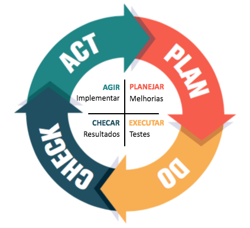

# Лекция 3

## Архитектуры операционной системы 
* Функциональная архитектура - это абстракция которая обеспечивает декомпозицию компонентов
* Аппаратная архитектура - совокупность програмных и аппаратных компонентов
* Системная архитектура
* Программная архитектура - организация кода

# Сегодня речь пойдет о функциональной архитектуре

### задача обеспечить
* производительность 
* надежность 
* безопасность
* Доступ к данным
* Доступ к оборудованию
* Доступ к обсепечению диалога между __ос__ и пользователем

### Основные функции ОС:
* Управление разработкой и исполнением пользовательского программного обеспечения
  * ПО должно быть независимо от аппаратного обеспечения
  * Нужно разработчику дать инструменты, которые абстрагируют его от аппаратоного слоя, что реализуется через __API__
  * Реализация API
    * > Мы пишем на java под windows, но мы не задумываемся о том, как усроен интерфейс взаимодействия java с windows. 
    * > Чтение файла: мы не задумываемся о том, как файл читается
  * Реализация управления и исполнения программ
    * > Щелкнули по браузеру и он запустился. Произошло множество действий от OS до того, как мы увидели окно браузера.
  * Приложение нужно поддерживать ресурсами
  * Обнаружение и обработка ошибок
    * Ловим какую-то ошибку и случается сбой
    * > Таким образом нам нужно правильно обрабатывать ошибки
  * Предоставление высокоуровнего доступа к устройствам ввода/вывода
    * > Мы не задумываемся о том, как устроен ввод/вывод на аппаратном уровне, мы абстрагированы от этого
  * Управление хранением данных - **Store**
    * Обеспечить проверку прав доступа
    * Обеспечить отложенную запись в **Store**
  * Мониторинг ресурсов
    * Приложение должно быть производительным на всех устройствах 
* Оптимизация использования ресурсов
    * Хотим, чтобы вложенные средства в аппаратное обеспечние продукта работали по максимуму за счет программного обеспечния.
    * Нужен механизм, который обеспечит многокритериальную оптимазацию
    * Одно из таких решений:
      * 
      * [PDCA](https://ru.wikipedia.org/wiki/%D0%A6%D0%B8%D0%BA%D0%BB_%D0%94%D0%B5%D0%BC%D0%B8%D0%BD%D0%B3%D0%B0) (__Plan-Do-Check-Act__ - __цикл Деминга__) решение - выполняем управление ресурсами и процессами в цикле
        * P - Планирование того, что мы хотим сделать
        * D - Выполнение плана
        * C - Проверка того, что мы хотели выполнить 
        * A - Вносим изменения, если мы не достигли соответсвующих показателей
* Поддержка эксплуатации вычислительного узла
  * О Чем речь? Когда испльзуются программы, могут происходить нештатные ситуации с оборудованием, в ос может проникнуть вирус. Для борьбы с такими ситуациями есть ряд механизмов:
    * Сисетмы диагностик - помогают отследить состояние вычсилительного узла, например __TOP__ в LInux
    * Средства для восстановления конфигурации ОСи
    * Средства для восстановления данных
      * Создание backup'ов
* Поддержка развития самой операционной системы - появялется новое ПО, новые технологии, мы можем что-то недотестировать и это выяснится в процессе эксплуатации.
  * Механизмы автоматического обновления
  * Мезанизмы, связанные с изменениями ошибок

## Вывод - структурирование функциональных подсистем. Что они из себя представляют в конечном итоге ?
* Управление процессами
  * Механизмы связанные с работой с структурой данных
  * Механизм планировщика 
* Подсистема управления памятью
  * Механизм виртуализации памяти - использование пересчета адресов из кода в реальные адреса
  * Механизм зашиты
* Управление файлами и каталогами
* Управление внешними устройствами
  * Драйвер <-> контроллер
  * Драйвер - системная подпрограмма, которая содержит в себе код, котрый получает на вход высокоуровневый запрос а на выход переводит это в низкоурвневые запросы.
    >Есть механизмы по автоматической установке драйверов
* Подсистема защиты информации
  * Выделение управлением безопасностью в отдельную подсистему
* Подсистема пользовательского интерфейса
  * CommandLine interface
  * GUI - графический интерфейс пользователя